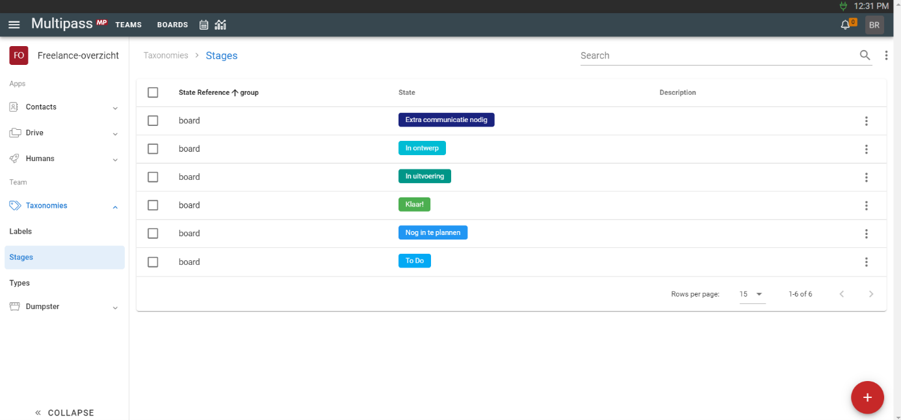
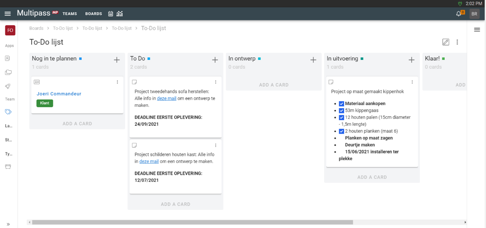

# Freelancer: meubel-klusjesman

> Korte kennismaking. Deze freelancer neemt allerlei projectjes aan die te maken hebben met meubels. Of het nu
> schilderen is, timmeren, zagen, ontwerpen of herstellen. Dankzij Multipass kan hij zijn klanten en leveranciers
> bijhouden en verliest hij nooit meer iets uit het oog.
<!-- excerpt -->
Korte kennismaking. Deze freelancer neemt allerlei projectjes aan die te maken hebben met meubels. Of het nu schilderen
is, timmeren, zagen, ontwerpen of herstellen. Dankzij Multipass kan hij zijn klanten en leveranciers bijhouden en
verliest hij nooit meer iets uit het oog.

## To-Do board

Om overzicht te bewaren over alle projecten of taken, kan je een board maken. Je maakt zelf de verschillende stappen dat
zo een project of taak moet doorlopen. Je kan bijvoorbeeld ook een sales funnel maken met alle stappen die je doorloopt
om van een geïnteresseerd persoon een vaste klant te maken.

