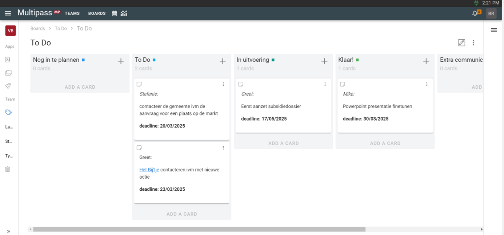

# Burkina Faso scholenproject
> Korte kennismaking Met een team van zes mensen zetten ze lokale acties op touw om geld op te halen voor een scholenproject in Burkina Faso. Ze hebben bijvoorbeeld al een sinterklaasactie en een paasactie die elk jaar terugkeren. Met Multipass werd het digitaal bijhouden van alle contacten, taken en bestellingen een eitje!
<!-- excerpt -->

## Labels voor rollen

Via verschillende kanalen doen particulieren hun bedrage. Omdat ieder jaar opnieuw acties gedaan worden, is het belangrijk te noteren wat de rol van de mensen is.

## Takenlijstje

In het scholenproject zijn zeer diverse taken te doen. Het takenbord helpt ons, jonge mensen met weinig ervaring in projectmanagement - toch de taken professioneel op te volgen en uit te voeren.

