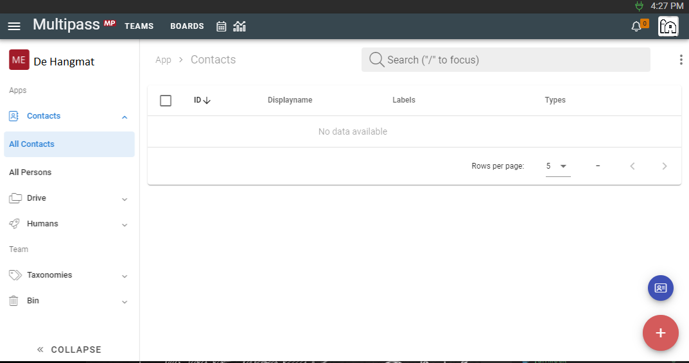

# VZW de positieve verandering
> Marleen zet zich al meer dan 20 jaar in voor mensen die het even moeilijk hebben. Op de hoeve "Hangmat" kan zo'n mens weer op adem komen. Het Hangmat concept wil ze nu ook digitaal aanbieden. Tijd voor opkuis in de contacten.
<!-- excerpt -->

Ik voelde zo de nood aan lenteschoonmaak in de rijkdom van de contacten, opgeslagen in de kelder of zolder van mijn pc. Meer dan 500 contacten die ik in de loop van de jaren verzameld hebt uit diverse kringen. Ik was op zoek naar de ideale gids voor een frisse start. Ondertussen zijn we jaren verder, de maatschappij en tools veranderen. De start betekent met een "digitale" bril kijken naar het concept van de hoeve ook op digitale wijze te organiseren. De Multipass helpt me oude contacten weer in hun volle potentieel te laten stralen als 'nieuw’...

Ik heb er voor gekozen om alle contacten in te geven en niet automatisch in te lezen. Onder het motto "rommel in, rommel uit" wilde ik niet werken. Als eerste stap heb ik een team in Multipass opgezet. Stap twee was nadenken over de groepen van contacten die ik heb zoals Raad van Bestuur, Vrienden van de "Hangmat", Nieuwsbrief lezers, Klankbordgroep, Bestuursvergadering. Blijkt dat ik die als labels kan ingeven. In een derde stap heb ik mijn eerste contactpersoon toegevoegd. Een sleutel hierbij is dat alle nieuwe ingaves beginnen met een PLUS knopje rechtsonder. Na dit eerste kwartiertje mijn "schoonmaakproducten" gekozen te hebben, begint nu het echte werk: opkuisen door in te geven. Ik zie het helemaal zitten, ook al zijn het er honderden en ben ik voor een tijdje zoet.

